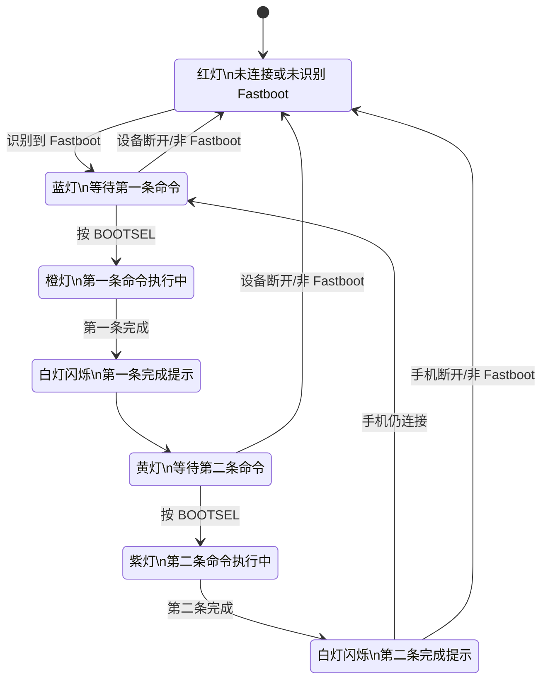

# RP2350 Fastboot 状态灯说明

本固件使用 RP2350-USB-A 板载 RGB 灯提示 Fastboot 连接状态和命令执行状态，并使用板载 BOOTSEL/BOOT 按键触发命令。

## 状态灯含义

| 灯光 | 状态说明 |
| --- | --- |
| 红灯 | 未连接手机，或未识别到 Fastboot 接口。 |
| 蓝灯 | 已连接 Fastboot，等待按 BOOTSEL 执行第一条命令。 |
| 橙灯 | 第一条命令执行中。 |
| 白灯闪烁后黄灯常亮 | 第一条命令完成，进入第二条命令等待状态。 |
| 黄灯 | 第一条命令已完成，等待按 BOOTSEL 执行第二条命令。 |
| 紫灯 | 第二条命令执行中。 |
| 白灯闪烁 | 第二条命令完成。 |

## 操作流程

1. 未连接手机或未识别到 Fastboot 接口时，状态灯为红灯。
2. 手机进入 Fastboot 模式并被识别后，状态灯变为蓝灯。
3. 蓝灯状态下，按一次 BOOTSEL 执行第一条命令，执行中显示橙灯。
4. 第一条命令完成后，白灯闪烁提示完成，然后黄灯常亮。
5. 黄灯状态下，按一次 BOOTSEL 执行第二条命令，执行中显示紫灯。
6. 第二条命令完成后，白灯闪烁提示完成。
7. 第二条命令完成后：
   - 如果手机仍连接并保持 Fastboot 模式，回到蓝灯，重新等待第一条命令。
   - 如果手机已断开或不再是 Fastboot 模式，回到红灯。

## 状态循环

